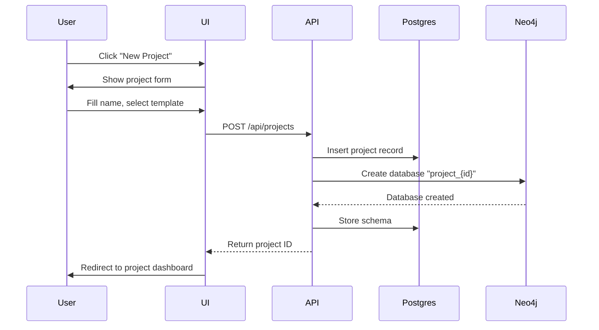
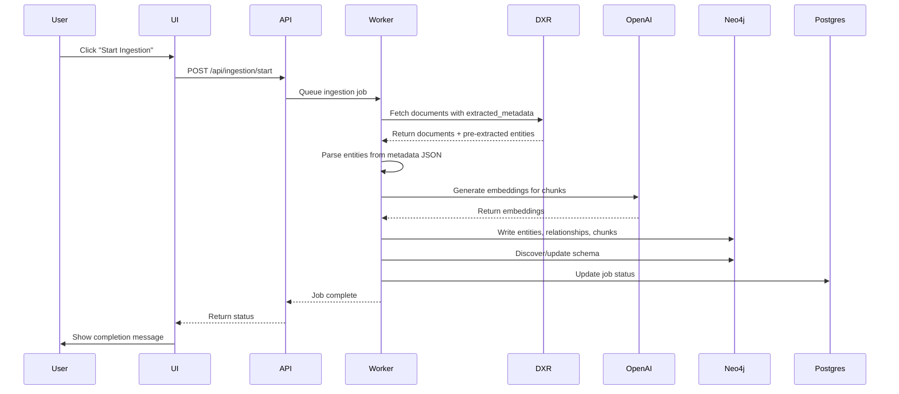
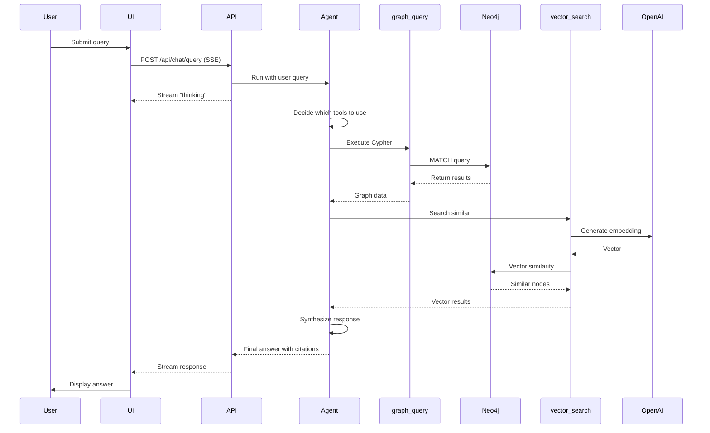

# Graph RAG System - Implementation Plan

## Overview

This document provides a phased, actionable implementation plan for building the Graph RAG platform. Each phase builds on the previous one, with clear deliverables, dependencies, and acceptance criteria.

**Estimated Timeline**: 10-12 weeks to production-ready v1  
**Team Size**: 2-3 developers  
**Working Model**: Agile sprints (2 weeks each)

## Project Structure

```
graph-rag/
├── backend/
│   ├── api/                    # FastAPI endpoints
│   ├── agent/                  # Single Pydantic AI agent + tools
│   ├── core/                   # Config, dependencies
│   ├── database/               # Neo4j, Postgres clients (with pgcrypto)
│   ├── ingestion/              # DXR client, embedder, graph writer
│   ├── services/               # Business logic, secrets service
│   ├── tests/                  # Unit + integration tests
│   ├── pyproject.toml          # uv dependencies
│   └── README.md
├── frontend/
│   ├── src/
│   │   ├── app/               # Next.js app router
│   │   ├── components/        # shadcn/ui components only
│   │   ├── lib/               # Utilities
│   │   └── types/             # TypeScript types
│   ├── public/
│   ├── package.json
│   └── README.md
├── infrastructure/
│   ├── docker-compose.yml     # Local development
│   └── kubernetes/            # K8s manifests (optional)
├── docs/
│   ├── VISION.md
│   ├── ARCHITECTURE.md
│   ├── IMPLEMENTATION.md      # This file
│   └── USER_GUIDE.md
├── scripts/
│   ├── setup_dev.sh           # Development environment setup
│   └── seed_project.sh        # Create sample project with data
├── .env.example
├── .gitignore
├── LICENSE
└── README.md
```

## Phase 0: Research & Setup (1 week)

### Goals
- Validate technology choices
- Set up development environment
- Create project scaffolding
- Define coding standards

### Tasks

#### 0.1 Technology Validation
**Owner**: Tech Lead  
**Duration**: 2 days

- [ ] Install Neo4j 5.13+ and test vector index creation
- [ ] Verify Pydantic AI 1.22+ with single agent + tools pattern
- [ ] Test OpenAI embeddings API (text-embedding-3-large)
- [ ] Test DXR `/api/v1/files` endpoint and metadata structure
- [ ] Verify PostgreSQL pgcrypto extension for API key encryption
- [ ] Document DXR extractor JSON format requirements

**Acceptance Criteria**:
- Neo4j vector search returns results in <100ms for 10K chunks
- Pydantic AI agent can call multiple tools sequentially
- Embeddings API supports batching (up to 100 texts)
- Can parse `extracted_metadata#EXTRACTOR_ID` from DXR files
- pgcrypto encrypts/decrypts API keys correctly

#### 0.2 Development Environment Setup
**Owner**: All developers  
**Duration**: 1 day

- [ ] Create Git repository and initial commit
- [ ] Set up Docker Compose for local development
  - Neo4j container with APOC plugin
  - PostgreSQL container with pgcrypto extension
  - (No Redis needed initially)
- [ ] Create `.env.example` with all required variables
- [ ] Write `scripts/setup_dev.sh` to automate setup
- [ ] Document installation steps in README

**Acceptance Criteria**:
- `./scripts/setup_dev.sh` successfully starts all services
- Developers can access Neo4j Browser at localhost:7474
- PostgreSQL accepts connections on localhost:5432

#### 0.3 Project Scaffolding
**Owner**: Tech Lead  
**Duration**: 2 days

- [ ] Initialize Python backend with uv
  - Create `pyproject.toml` with dependencies
  - Set up FastAPI project structure
  - Configure pytest, black, mypy
- [ ] Initialize Next.js frontend with TypeScript
  - Set up shadcn/ui components
  - Configure ESLint, Prettier
  - Set up TanStack Query
- [ ] Create CI/CD pipeline (GitHub Actions)
  - Lint, type-check, test on PR
  - Build Docker images on merge to main

**Acceptance Criteria**:
- `uv sync` installs all backend dependencies
- `npm install` sets up frontend
- CI pipeline runs successfully on sample PR

#### 0.4 Coding Standards & Documentation
**Owner**: Tech Lead  
**Duration**: 1 day

- [ ] Create CONTRIBUTING.md with guidelines
- [ ] Set up pre-commit hooks (black, mypy, eslint)
- [ ] Define Git workflow (branch naming, commit messages)
- [ ] Create issue templates for GitHub
- [ ] Set up project board for task tracking

**Deliverables**:
- Fully configured development environment
- Project scaffolding with passing CI
- Documentation for onboarding new developers

---

## Phase 1: The Searchable Graph (3 weeks)

### Goals
- Establish end-to-end data pipeline (DXR → Neo4j)
- Implement basic vector search capability
- Create simple chat interface for testing

### Sprint 1.1: Ingestion Foundation (Week 1)

#### 1.1.1 DXR Client & Parser
**Owner**: Backend Dev 1
**Duration**: 3 days
- [ ] Implement `DXRClient` with async support and retries
- [ ] Create `DXRMetadataParser` to extract entities/relationships from JSON
- [ ] Write tests with mocked DXR responses

#### 1.1.2 Graph Storage Core
**Owner**: Backend Dev 2
**Duration**: 2 days
- [ ] Implement `Neo4jClient` with connection pooling
- [ ] Create `GraphWriter` service to write nodes and edges
- [ ] Set up vector indexes in Neo4j

### Sprint 1.2: Retrieval & Search (Week 2)

#### 1.2.1 Embedding Service
**Owner**: Backend Dev 1
**Duration**: 2 days
- [ ] Implement OpenAI embedding generation with batching
- [ ] Add simple caching/deduplication for embeddings

#### 1.2.2 Vector Search Tool
**Owner**: Backend Dev 2
**Duration**: 3 days
- [ ] Implement `vector_search` function (semantic search)
- [ ] Create basic `QueryAgent` that uses only this tool initially
- [ ] Expose via simple API endpoint

### Sprint 1.3: Basic UI & Integration (Week 3)

#### 1.3.1 Simple Chat UI
**Owner**: Frontend Dev
**Duration**: 5 days
- [ ] Build basic chat interface (Next.js + shadcn/ui)
- [ ] Connect to backend API
- [ ] Display raw search results (nodes/text)

#### 1.3.2 End-to-End Pipeline
**Owner**: Backend Dev 1
**Duration**: 3 days
- [ ] Orchestrate ingestion: Fetch -> Parse -> Embed -> Write
- [ ] Add basic job tracking in Postgres
- [ ] Verify data flows from DXR to Graph to UI

**Phase 1 Deliverables**:
- ✅ Working ingestion pipeline
- ✅ Data stored in Neo4j with vector indexes
- ✅ Basic semantic search UI

---

## Phase 2: The Connected Graph (3 weeks)

### Goals
- Enable graph reasoning (relationships, traversal)
- Implement schema discovery and deduplication
- Upgrade Agent with graph-specific tools

### Sprint 2.1: Schema & Quality (Week 4)

#### 2.1.1 Schema Discovery
**Owner**: Backend Dev 1
**Duration**: 3 days
- [ ] Implement dynamic schema inference from ingested data
- [ ] Store and cache schema definitions
- [ ] Update schema as new data arrives

#### 2.1.2 Entity Resolution
**Owner**: Backend Dev 2
**Duration**: 4 days
- [ ] Implement deduplication logic (merge by ID/properties)
- [ ] Handle conflicting property values
- [ ] Ensure relationships are preserved during merge

### Sprint 2.2: Graph Tools (Week 5)

#### 2.2.1 Advanced Graph Tools
**Owner**: Backend Dev 1
**Duration**: 3 days
- [ ] Implement `graph_query` (Cypher) tool
- [ ] Implement `get_neighbors` and `traverse` tools
- [ ] Add safety checks for generated Cypher

#### 2.2.2 Hybrid Search
**Owner**: Backend Dev 2
**Duration**: 2 days
- [ ] Combine Vector Search + Graph Traversal
- [ ] Implement re-ranking logic

### Sprint 2.3: Agent Intelligence (Week 6)

#### 2.3.1 Agent Orchestration
**Owner**: Backend Dev 1
**Duration**: 4 days
- [ ] Upgrade `QueryAgent` to use all new tools
- [ ] Implement reasoning loop (Plan -> Execute -> Refine)
- [ ] Add citation support to responses

#### 2.3.2 Streaming Responses
**Owner**: Backend Dev 2
**Duration**: 3 days
- [ ] Implement SSE for token streaming
- [ ] Update UI to show "Thinking..." steps

**Phase 2 Deliverables**:
- ✅ Smart Agent with Graph + Vector tools
- ✅ Schema-aware ingestion
- ✅ High-quality responses with citations

---

## Phase 3: Intelligent Visual Reasoning (3 weeks)

### Vision

Transform the chat interface into a transparent reasoning workspace where users can see exactly how the RAG agent thinks and explores the knowledge graph. Each agent action becomes an interactive, expandable component that visualizes graph operations in real-time.

**Key Principle**: Show the agent's reasoning process, not just the final answer.

### Goals
- Surface agent reasoning steps in the chat UI
- Visualize graph operations interactively
- Enable users to explore agent discoveries
- Demonstrate DXR → Graph → RAG value chain

### Sprint 3.1: Agent Reasoning UI (Week 7)

#### 3.1.1 Streaming Agent Steps
**Owner**: Backend Dev + Frontend Dev  
**Duration**: 3 days

**Backend:**
- [ ] Modify agent to emit reasoning steps via Server-Sent Events (SSE)
- [ ] Create `/api/chat/query/stream` endpoint
- [ ] Emit step events: `tool_call_start`, `tool_call_result`, `thinking`, `answer`
- [ ] Include tool name, parameters, and results in events

**Frontend:**
- [ ] Create `ReasoningStep` component (expandable/collapsible)
- [ ] Implement SSE client for streaming responses
- [ ] Show "Learning about the graph structure..." with loading state
- [ ] Display tool calls as expandable cards

**Acceptance Criteria**:
- User sees real-time updates as agent thinks
- Each tool call appears as an expandable step
- Steps can be collapsed/expanded independently
- Final answer appears after all reasoning steps

#### 3.1.2 Minimal Chat UI Redesign
**Owner**: Frontend Dev  
**Duration**: 2 days

- [ ] Simplify chat interface (remove heavy cards)
- [ ] Focus on reasoning step timeline
- [ ] Add step-by-step visual indicators (icons per tool)
- [ ] Implement smooth animations for step expansion

**Acceptance Criteria**:
- Clean, minimal chat interface
- Clear visual hierarchy for reasoning steps
- Smooth expand/collapse animations

### Sprint 3.2: Interactive Graph Visualization (Week 8)

#### 3.2.1 Inline Graph Preview Component
**Owner**: Frontend Dev  
**Duration**: 4 days

- [ ] Install react-force-graph-2d or similar library
- [ ] Create `GraphPreview` component (embedded in reasoning step)
- [ ] Show nodes as bubbles with labels
- [ ] Show relationships as directed edges
- [ ] Color-code nodes by entity type
- [ ] Add hover tooltips for node properties

**Tech Choice**: 
- Consider: react-force-graph-2d, vis-network, or cytoscape.js
- Must support: click events, property inspection, responsive sizing

**Acceptance Criteria**:
- Graph renders within reasoning step card (300px height)
- Nodes are clickable to view properties
- Relationships show type labels
- Responsive to container size

#### 3.2.2 Full-Screen Graph Explorer
**Owner**: Frontend Dev  
**Duration**: 3 days

- [ ] Create modal/dialog for expanded graph view
- [ ] Add "Expand" button to inline graph preview
- [ ] Implement full-screen graph with controls:
  - Zoom in/out
  - Pan
  - Search for nodes
  - Filter by node type
  - Export as PNG/SVG
- [ ] Show property panel on node click
- [ ] Add relationship inspector

**Acceptance Criteria**:
- Click "Expand" opens full-screen modal
- All graph interactions work at full size
- Property panel shows node/relationship metadata
- Can export graph visualization

#### 3.2.3 Tool-Specific Visualizations
**Owner**: Frontend Dev  
**Duration**: 3 days

- [ ] `discover_schema` → Show schema diagram (entity types + relationships)
- [ ] `entity_lookup` → Show matched entities as cards
- [ ] `graph_neighbors` → Show ego network (central node + neighbors)
- [ ] `graph_query` → Show Cypher results as interactive graph
- [ ] `vector_search` → Show document chunks with relevance scores

**Acceptance Criteria**:
- Each tool type has custom visualization
- Visualizations are consistent with tool semantics
- User can understand what the agent discovered

### Sprint 3.3: Interactive Exploration Features (Week 9)

#### 3.3.1 Click-to-Expand Node Neighbors
**Owner**: Frontend Dev  
**Duration**: 2 days

- [ ] Add double-click handler on graph nodes
- [ ] Fetch neighbors on demand via API
- [ ] Animate new nodes appearing in graph
- [ ] Maintain graph layout with force simulation

**API Endpoint**:
```
GET /api/graph/nodes/{node_id}/neighbors?depth=1
```

**Acceptance Criteria**:
- Double-click node fetches and displays neighbors
- Graph layout adjusts smoothly
- Loading state shown while fetching
- Max depth limit enforced (3 hops)

#### 3.3.2 Property Inspector Panel
**Owner**: Frontend Dev  
**Duration**: 2 days

- [ ] Create side panel for selected node/relationship
- [ ] Show all properties in tabular format
- [ ] Display metadata (type, id, source document)
- [ ] Add "View in Neo4j Browser" link (if available)
- [ ] Show connected relationships list

**Acceptance Criteria**:
- Click node opens property panel
- All properties visible and formatted
- Can navigate to related nodes
- Panel closes on deselect

#### 3.3.3 Reasoning Step Export
**Owner**: Frontend Dev  
**Duration**: 1 day

- [ ] Add "Export Reasoning" button to chat
- [ ] Export as JSON with all steps and results
- [ ] Export as PDF report (optional)
- [ ] Copy reasoning steps to clipboard

**Acceptance Criteria**:
- Can export full reasoning trace
- JSON includes all tool calls and results
- Shareable for debugging/documentation

### Sprint 3.4: DXR → Graph Value Chain (Week 9)

#### 3.4.1 Source Traceability
**Owner**: Backend Dev  
**Duration**: 2 days

- [ ] Track which DXR file each entity came from
- [ ] Store `source_file_id` on Entity nodes
- [ ] Add endpoint to get DXR file details
- [ ] Show source attribution in property panel

**Acceptance Criteria**:
- Each entity links back to source DXR file
- User can see original file that contributed entity
- Property panel shows "Source: file-123.pdf"

#### 3.4.2 Metadata Lineage Visualization
**Owner**: Frontend Dev  
**Duration**: 2 days

- [ ] Create "How did we get this?" feature
- [ ] Show lineage: DXR File → Extractor → Entity → Graph → RAG Answer
- [ ] Visualize as flow diagram
- [ ] Accessible from property panel

**Acceptance Criteria**:
- User can trace any entity back to DXR source
- Flow diagram shows extraction → storage → retrieval
- Clear demonstration of value chain

**Phase 3 Deliverables**:
- ✅ Streaming agent reasoning UI with expandable steps
- ✅ Interactive graph visualization (inline + full-screen)
- ✅ Tool-specific visualizations (schema, neighbors, Cypher results)
- ✅ Node property inspector and click-to-expand
- ✅ DXR → Graph → RAG value chain visualization
- ✅ Reasoning step export functionality

**Value Proposition**:
Users can literally see how DXR metadata flows into the knowledge graph and how the RAG agent formulates answers by exploring that graph structure. This transparency builds trust and demonstrates the power of graph-based RAG.

---

## Phase 4: Production Hardening (3 weeks)

### Goals
- Secure the platform (Auth, RBAC)
- Optimize performance
- Prepare for deployment

### Sprint 4.1: Security (Week 10)

#### 4.1.1 Authentication & RBAC
**Owner**: Backend Dev 1
**Duration**: 5 days
- [ ] Implement full JWT Auth
- [ ] Add Role-Based Access Control (Admin/Editor/Viewer)
- [ ] Secure all API endpoints

### Sprint 4.2: Multi-Tenancy & Scale (Week 11)

#### 4.2.1 Multi-Tenancy
**Owner**: Backend Dev 2
**Duration**: 4 days
- [ ] Isolate data per project (separate DBs or labels)
- [ ] Enforce strict data boundaries

#### 4.2.2 Optimization
**Owner**: Backend Dev 1
**Duration**: 3 days
- [ ] Add caching for frequent queries
- [ ] Optimize Neo4j indexes and config

### Sprint 4.3: Deployment (Week 12)

#### 4.3.1 Infrastructure as Code
**Owner**: DevOps
**Duration**: 3 days
- [ ] Finalize Docker/K8s manifests
- [ ] Set up CI/CD pipelines

#### 4.3.2 Documentation & QA
**Owner**: All
**Duration**: 2 days
- [ ] Finalize User Guide and API Docs
- [ ] Run final load tests

**Phase 4 Deliverables**:
- ✅ Secure, Multi-tenant Architecture
- ✅ Production-ready Performance
- ✅ Automated Deployment

---

## Post-Launch: Iteration & Enhancement

### Week 13+: Continuous Improvement

#### Backlog Items (Prioritize Based on Feedback)

**High Priority**:
- [ ] Schema evolution tools (add fields without breaking)
- [ ] Advanced graph algorithms (PageRank, community detection)
- [ ] Bulk data import (CSV, JSON, Parquet)
- [ ] Export graph to other formats (GraphML, GEXF)
- [ ] Mobile-responsive UI improvements

**Medium Priority**:
- [ ] Natural language query suggestions
- [ ] Automated relationship discovery (ML-based)
- [ ] Schema auto-inference from sample documents
- [ ] Multi-language support (embeddings, UI)
- [ ] Collaboration features (shared queries, annotations)

**Low Priority**:
- [ ] Custom LLM model support (beyond OpenAI)
- [ ] Real-time ingestion (webhook-based)
- [ ] Graph versioning and time-travel queries
- [ ] Integration with BI tools (Tableau, PowerBI)

---

## Risk Mitigation Plan

### Technical Risks

| Risk | Mitigation | Contingency |
|------|------------|-------------|
| Neo4j vector search underperforms | Benchmark early in Phase 0; compare with pgvector | Fall back to separate vector DB (Qdrant, Pinecone) |
| LLM extraction quality poor | Create evaluation dataset in Phase 1; iterate on prompts | Add human-in-the-loop review step |
| Cypher generation hallucinations | Validate with `EXPLAIN`; sandbox execution | Limit to predefined query templates |
| Multi-tenancy isolation fails | Test with penetration testing in Phase 4 | Separate infrastructure per project |
| Ingestion too slow | Profile and optimize in Phase 4 | Use distributed workers (Celery, Ray) |

### Team Risks

| Risk | Mitigation | Contingency |
|------|------------|-------------|
| Key developer leaves | Document all decisions; pair programming | Cross-train team members |
| Scope creep | Strict phase boundaries; prioritize backlog | Defer features to post-launch |
| Burnout | Realistic estimates; avoid overtime | Extend timeline if needed |

### Business Risks

| Risk | Mitigation | Contingency |
|------|------------|-------------|
| No adoption from clients | Early user testing; gather feedback | Pivot to different use cases |
| Competing product launched | Focus on unique value (DXR integration, customization) | Accelerate roadmap |
| Budget constraints | Use open-source tools; minimize cloud costs | Reduce scope or team size |

---

## Success Metrics

### Phase 1 (MVP)
- [ ] Ingest 1000 documents in <2 hours
- [ ] Extract entities with >70% accuracy (manual eval)
- [ ] Query latency <5s for simple keyword search
- [ ] Developer can set up environment in <1 hour

### Phase 2 (Agents)
- [ ] Hybrid queries return results in <3s
- [ ] Query understanding accuracy >85%
- [ ] Agent token usage <50K tokens/day
- [ ] Logfire shows complete traces for all queries

### Phase 3 (UX)
- [ ] Graph browser renders 1000 nodes at 60fps
- [ ] Schema designer saves valid schemas 100%
- [ ] User can create project in <5 minutes

### Phase 4 (Production)
- [ ] Support 10 concurrent projects
- [ ] Handle 100K documents across all projects
- [ ] P95 query latency <2s
- [ ] Zero critical security issues

### Post-Launch
- [ ] 5+ active client projects
- [ ] User satisfaction score >4/5
- [ ] Onboarding new project in <1 day
- [ ] 90% uptime SLA

---

## Dependencies & Blockers

### External Dependencies
- **Data X-Ray API**: Requires API key and datasource access
- **OpenAI API**: Requires API key and sufficient quota
- **Neo4j License**: Community Edition sufficient for dev; may need Aura for production
- **Pydantic Logfire**: Optional but highly recommended for observability

### Cross-Team Dependencies
- **Design**: UI/UX mockups for graph browser, schema designer
- **Security**: Penetration testing, security audit
- **DevOps**: Kubernetes cluster setup, secrets management

### Potential Blockers
- Neo4j vector search not available in Community Edition → Use Aura or alternative
- OpenAI rate limits → Implement backoff, caching, or use Azure OpenAI
- DXR API changes → Version API calls, handle breaking changes gracefully
- Team availability → Adjust timeline, reduce scope

---

## Testing Strategy

### Unit Tests
- **Coverage target**: 80%+
- **Tools**: pytest, pytest-asyncio, pytest-mock
- **Focus**: Business logic, schema validation, agent prompt engineering

### Integration Tests
- **Tools**: pytest with real Neo4j (Docker), real Postgres
- **Focus**: End-to-end ingestion, query workflows, database operations

### E2E Tests
- **Tools**: Playwright (frontend + backend)
- **Focus**: User journeys (create project, ingest data, query, view graph)

### Performance Tests
- **Tools**: Locust (API load testing), Neo4j profiler
- **Focus**: Query latency under load, ingestion throughput

### Security Tests
- **Tools**: OWASP ZAP, manual penetration testing
- **Focus**: Authentication, authorization, injection attacks, secrets exposure

---

## Communication & Collaboration

### Daily Standups (15 min)
- What did you do yesterday?
- What will you do today?
- Any blockers?

### Sprint Planning (2 hours, start of each sprint)
- Review backlog
- Select tasks for sprint
- Assign owners and estimate effort

### Sprint Review (1 hour, end of each sprint)
- Demo completed features
- Gather feedback
- Update roadmap

### Retrospective (1 hour, end of each sprint)
- What went well?
- What didn't go well?
- Action items for improvement

### Weekly Sync with Stakeholders
- Progress update
- Demo new features
- Discuss priorities and blockers

---

## Code Review Guidelines

### Before Creating PR
- [ ] All tests pass locally
- [ ] Code is formatted (black, prettier)
- [ ] Type checks pass (mypy, tsc)
- [ ] Documentation updated (docstrings, README)

### Review Checklist
- [ ] Code follows style guide
- [ ] Tests cover new functionality
- [ ] No secrets or credentials in code
- [ ] Performance considerations addressed
- [ ] Security implications reviewed

### Merge Requirements
- [ ] 1+ approvals from team members
- [ ] CI pipeline passes
- [ ] No merge conflicts

---

## Deployment Strategy

### Environments
1. **Local**: Developer machines (Docker Compose)
2. **CI**: GitHub Actions ephemeral environments
3. **Staging**: Kubernetes cluster (auto-deploy from main)
4. **Production**: Kubernetes cluster (manual promotion)

### Deployment Process
1. Merge PR to main → CI builds Docker images
2. Auto-deploy to staging → Run E2E tests
3. Manual approval → Deploy to production
4. Monitor Logfire for errors → Rollback if needed

### Rollback Plan
- Keep last 3 Docker image versions
- Use Kubernetes rolling updates (zero downtime)
- Rollback command: `kubectl rollout undo deployment/backend`

---

## Budget Estimate

### Infrastructure Costs (Monthly)

| Service | Tier | Cost |
|---------|------|------|
| Neo4j Aura | Professional (8GB) | $500 |
| PostgreSQL (RDS) | db.t3.medium | $100 |
| Kubernetes (EKS/GKE) | 3 nodes (t3.medium) | $150 |
| OpenAI API | ~10M tokens/month | $200 |
| Pydantic Logfire | Team plan | $100 |
| **Total** | | **~$1050/month** |

### Development Costs

| Phase | Duration | Team (2 devs @ $150/hr) | Total |
|-------|----------|-------------------------|-------|
| Phase 0 | 1 week | 80 hours | $12,000 |
| Phase 1 | 3 weeks | 240 hours | $36,000 |
| Phase 2 | 3 weeks | 240 hours | $36,000 |
| Phase 3 | 3 weeks | 240 hours | $36,000 |
| Phase 4 | 3 weeks | 240 hours | $36,000 |
| **Total** | **13 weeks** | **1040 hours** | **$156,000** |

### Grand Total
**Development**: $156,000 (one-time)  
**Infrastructure**: $1,050/month (recurring)

---

## Open Questions & Decisions Needed

### Technical Decisions
1. **Schema storage format**: How to serialize discovered schemas in Postgres?
2. **Graph browser**: Build custom or buy Neo4j Bloom license?
3. **Multi-tenancy**: Separate databases per project (confirmed)
4. **DXR extractor**: Which extractor ID(s) to use for entity extraction?

### Product Decisions
1. **Pricing model**: Per-project, per-user, or per-document?
2. **Target market**: Focus on one vertical (legal, research) or horizontal?
3. **Self-hosted option**: Provide Docker images for on-prem deployment?
4. **Open-source**: Make foundation open-source, charge for enterprise features?

### Organizational Decisions
1. **Team composition**: Hire additional frontend dev?
2. **QA process**: Dedicated QA or developer-owned testing?
3. **Support model**: Community forum, ticketing system, or dedicated support?

---

## Appendix: Example Workflows

### Workflow 1: Create New Project



### Workflow 2: Ingest Documents



### Workflow 3: Query Execution



---

**Document Owner**: AI Development Team  
**Last Updated**: November 24, 2025  
**Status**: Draft for Review  
**Related**: VISION.md, ARCHITECTURE.md

---

## Next Steps

1. **Review Documents**: Share VISION.md, ARCHITECTURE.md, and IMPLEMENTATION.md with team
2. **Prioritize Features**: Stakeholder meeting to finalize scope
3. **Assign Owners**: Designate tech lead and assign phase owners
4. **Set Up Project**: Create GitHub repo, project board, CI/CD
5. **Kickoff Phase 0**: Technology validation and environment setup

**Ready to build? Let's go! 🚀**
