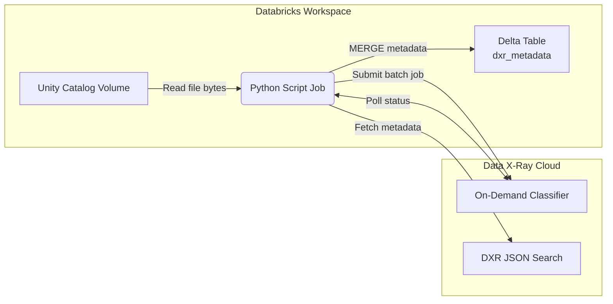

# Data X-Ray ↔ Databricks Unity Catalog Integration Playbook

This playbook ships a Databricks **Python script job** that scans a Unity Catalog Volume, submits files to the Data X-Ray On-Demand Classifier (ODC), and persists the returned metadata into a managed Unity Catalog table. Jobs can run directly on Databricks without packaging.

## How It Works



1. **Volume Scanner** – Walks `/Volumes/<catalog>/<schema>/<volume>` (optionally under a prefix) to enumerate files. The scanner records the absolute path, relative path, size, and modification time for each file.
2. **On-Demand Classifier Client** – Streams multi-part uploads to `POST /api/on-demand-classifiers/{datasource_id}/jobs`, polls job status until it reaches a terminal state, and issues a `DXR_JSON_QUERY` search keyed by `dxr#datasource_scan_id`.
3. **Metadata Store** – Converts DXR hits into structured rows keyed by the Unity Catalog file path and merges them into a managed Delta table with Spark SQL. Repeated runs simply update the existing rows.

## Runtime Configuration

Inject the following environment variables into the Databricks job task:

| Variable | Description |
| --- | --- |
| `VOLUME_CATALOG`, `VOLUME_SCHEMA`, `VOLUME_NAME` | Unity Catalog volume to scan; optional `VOLUME_PREFIX` scopes to a subdirectory. |
| `VOLUME_BASE_PATH` | Optional override for the base filesystem path (defaults to `/Volumes`). Helpful for local tests. |
| `DXR_BASE_URL` | Data X-Ray API host (e.g. `https://api.ohalo.co`). |
| `DXR_DATASOURCE_ID` | Datasource ID for the On-Demand Classifier. |
| `DXR_POLL_INTERVAL_SECONDS` | Poll frequency in seconds (default `10`). |
| `DXR_MAX_BYTES_PER_JOB` | Byte budget per DXR submission (default `30MB`). |
| `DXR_VERIFY_SSL` | Set to `false` to allow self-signed certificates in dev/test (default `true`). |
| `DXR_CA_BUNDLE_PATH` | Optional absolute path to a custom CA bundle for DXR TLS verification. |
| `DXR_API_PREFIX` | Override API prefix (default `/api`). Set to empty when targeting deployments that expose endpoints at the root. |
| `DXR_SECRET_SCOPE` / `DXR_SECRET_KEY` | Databricks secret scope + key that store the DXR API token. |
| `METADATA_CATALOG`, `METADATA_SCHEMA`, `METADATA_TABLE` | Target Unity Catalog location for the managed metadata table. |

The script automatically creates the metadata table if it does not exist:

```sql
CREATE TABLE IF NOT EXISTS <catalog>.<schema>.<table> (
  file_path STRING,
  relative_path STRING,
  catalog_name STRING,
  schema_name STRING,
  volume_name STRING,
  file_size BIGINT,
  modification_time BIGINT,
  datasource_id STRING,
  datasource_scan_id BIGINT,
  job_id STRING,
  labels ARRAY<STRING>,
  tags ARRAY<STRING>,
  categories ARRAY<STRING>,
  raw_metadata STRING,
  collected_at TIMESTAMP
) USING DELTA;
```

Rows are merged on `file_path`, so reclassifying a file simply updates its metadata.

## Deploying the Job

1. Upload or reference this repository in your Databricks workspace.
2. Create a **Python script task** that runs `python scripts/run_pipeline.py`.
3. Attach a cluster running DBR 14.x LTS (Photon recommended) sized for your largest batch upload.
4. Configure the environment variables above in the task UI.
5. Store the DXR API key in Databricks Secrets and reference it via `DXR_SECRET_SCOPE`/`DXR_SECRET_KEY`.
6. Grant the cluster principal read access to the Unity Catalog volume and write access to the metadata table location.
7. Schedule the job as needed (hourly, daily, etc.).

## Local Development

Only unit tests and linting can run locally (reading from Unity Catalog volumes and Databricks Secrets requires a Databricks workspace). Use the provided requirements files:

```bash
cd databricks-unity-dxr-integration
python -m venv .venv && source .venv/bin/activate
pip install -r requirements-dev.txt
pytest
```

## References

- On-Demand Classifier workflow example: `../dxr/xray-docs/content/docs/usage/advanced/on-demand-classifier/workflow.mdx`
- Databricks Jobs (Python script tasks): https://docs.databricks.com/en/jobs/jobs.html#python-script-task
