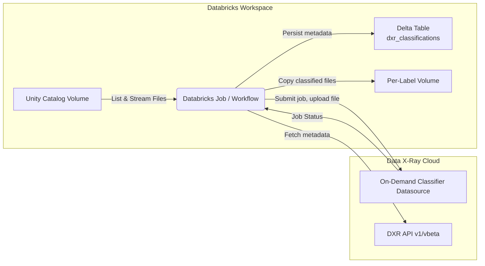

# Data X-Ray ↔ Databricks Unity Catalog Integration Playbook
Data X-Ray version: **7.21.1**

## What is this?
This playbook designs and prototypes a pipeline that synchronizes Data X-Ray’s rich content intelligence back into Databricks Unity Catalog. The goal is to classify files stored in Databricks Volumes with the On-Demand Classifier (ODC), apply Data X-Ray labels, and reorganize or curate downstream storage in Databricks using those labels.

## Target Outcomes
- Continuously ingest files from a Unity Catalog Volume and stream their bytes to Data X-Ray ODC.
- Poll for job completion and fetch full metadata for processed files using the `DXR_JSON_QUERY` search APIs.
- Persist Data X-Ray labels, categories, and AI extractor outputs in Databricks so analysts can query everything alongside native governance data.
- Mirror or copy files into Unity Catalog Volumes partitioned by label, enabling fine-grained access controls.
- Provide extension points for richer metadata surfaces (Delta tables, Databricks Unity Catalog tags, downstream Lakehouse ETL).

## High-Level Architecture


### Components
- **Volume Harvester** – Uses the Databricks Python SDK (`databricks-sdk`) to enumerate Unity Catalog Volumes (`/Volumes/<catalog>/<schema>/<volume>`). Maintains a checkpoint of processed file versions to support incremental scans.
- **ODC Submission Worker** – Streams file bytes directly to `POST /api/on-demand-classifiers/{datasource_id}/jobs` (multi-part upload) and records returned job IDs.
- **Job Tracker** – Polls `GET /api/on-demand-classifiers/{datasource_id}/jobs/{job_id}` until a job lands in `FINISHED` or `FAILED`. Retries transient failures with exponential backoff.
- **Metadata Collector** – Queries `POST /api/indexed-files/search` with the `dxr#datasource_scan_id` filter to retrieve labels (`dxr#labels`), tags (`dxr#tags`), AI categories (`ai#category`), and extractor payloads.
- **Databricks Persistence Layer** – Writes metadata into a managed Delta table (e.g. `catalog.governance.dxr_classifications`) keyed by the Unity Catalog file path so that downstream jobs can `SELECT` or join on classification state.
- **Label-Based Volumes** – Ensures one Unity Catalog Volume per Data X-Ray label (e.g. `volume_sensitive_financial`), then copies files that received that label back into the corresponding volume. Copy is gated behind idempotency checks to avoid duplicates.

## Suggested Workflow
1. **Bootstrap** – Deploy a Databricks Job that runs the playbook wheel on a serverless or light compute cluster. Populate configuration via secrets or `.env`:
   - Databricks host / token (`DATABRICKS_HOST`, `DATABRICKS_TOKEN`)
   - Target catalog, schema, and source volume
   - SQL Warehouse for Delta interactions (`DATABRICKS_WAREHOUSE_ID`) and checkpoint table (`DATABRICKS_CHECKPOINT_TABLE`)
   - Optional tracking tables for job ledger / metadata (`DATABRICKS_JOB_LEDGER_TABLE`, `DATABRICKS_METADATA_TABLE`)
   - Data X-Ray API token & base URL (`DXR_BASE_URL`, `DXR_API_KEY`)
   - ODC datasource ID and polling interval
2. **Incremental Scan** – List files within the source volume, comparing modification time and checksum to a checkpoint table so only new or updated objects are uploaded.
3. **Submit to ODC** – Batch files into jobs sized by configurable max total bytes per job. Use multi-part uploads to minimize memory pressure.
4. **Poll & Collect** – Track job completion; once finished, search by `datasourceScanId` to pull metadata.
5. **Persist Metadata** – Upsert rows into `dxr_classifications` Delta table with the full metadata payload plus Databricks location details (catalog, schema, volume, relative path, version).
6. **Organize by Label** – For each dominant label:
   - Ensure the destination volume exists via `UnityCatalog.Volumes.create`.
   - Copy the file locally (`Files.download`) and write to `/Volumes/<catalog>/<schema>/<label_volume>/…`.
   - Optionally attach Unity Catalog tags or grants to the per-label volume.
7. **Surface to Users** – Provide DBSQL dashboards or simple notebooks that query the Delta table and navigate to labelled replicas.

## Databricks Execution Architecture
### Compute Footprint
- **Primary option**: Databricks Job running on a *single-task* job cluster (DBR 14.x LTS, Photon enabled) sized to fit the largest expected file batches. Auto-terminate when idle to minimise cost.
- **Serverless alternative**: Databricks Serverless Jobs for fully managed compute. Ideal if the workspace has serverless enabled and file volumes are moderate (<25 GB per run).
- **Workflow fan-out**: Multi-task Workflow with task dependencies (`Ingest → Classify → Persist → Organise`). Each task can reuse the same job cluster or run on task-specific serverless compute if isolation is required.

### Dependency Packaging
- Build a wheel from this project (`uv build` or `python -m build`) and upload it to DBFS or a workspace Files repository, then reference it via a *Python Wheel* task.
- For rapid iteration, use a `%pip install "git+https://..."` notebook task that installs the repo branch into the ephemeral cluster, then call `python -m databricks_unity_dxr_integration.pipeline`.
- Pin dependency versions via `pyproject.toml` (already present). When using wheels, include the dependency manifest in the wheel or call `pip install databricks-unity-dxr-integration[dev]` inside an init script.

### Configuration & Secrets Management
- Map `.env` keys into Databricks Secret Scopes (e.g., `dxr-integration`) and read them at runtime via `os.environ["DATABRICKS_HOST"]` after injecting `secrets.get` results.
- Non-secret parameters (catalog, schema, volume) can be passed as job *parameters* to allow environment-specific overrides without code changes.
- Provide a helper notebook or shell script to materialise the `.env` file during local testing while production jobs rely on secrets.

### Job / Workflow Structure
1. **Task: ingest_and_submit**
   - Entry point: `python -m databricks_unity_dxr_integration.pipeline ingest`
   - Responsibilities: enumerate files, batch uploads, submit ODC jobs, persist job IDs in a checkpoint table.
2. **Task: poll_and_collect** (depends on ingest)
   - Entry point: `python -m databricks_unity_dxr_integration.pipeline collect`
   - Responsibilities: poll job statuses, fetch metadata, upsert into `dxr_classifications`.
3. **Task: organise_by_label** (depends on collect)
   - Entry point: `python -m databricks_unity_dxr_integration.pipeline organise`
   - Responsibilities: ensure label volumes exist, copy files, apply Unity Catalog grants/tags.
4. Optional **Task: notify** – Publish run results (metrics, failure summary) to Slack/Teams via a Databricks notebook or web-hook call.

Retries are handled at both the Databricks task level (configure `max_retries`, `min_retry_interval_millis`) and inside the code via `tenacity`.

## Data X-Ray API Usage (7.21.1)
- **Submit job**: `POST /api/on-demand-classifiers/{datasource_id}/jobs`
- **Job status**: `GET /api/on-demand-classifiers/{datasource_id}/jobs/{job_id}`
- **Fetch metadata**: `POST /api/indexed-files/search` (with `mode = DXR_JSON_QUERY`)
- **Retrieve binary**: `GET /api/v1/files/{id}/content`
- **Supported extras**: `GET /api/v1/files/{id}/redacted-text` if redaction is required before copying back.

## Alternative Architectures
1. **S3/Lambda Fan-Out** – If Databricks Volumes are backed by S3, an AWS Lambda could respond to S3 notifications, push files to Data X-Ray, and only call back into Databricks to register metadata. Databricks would consume a Delta table managed outside the workspace.
2. **Event-Driven Notebooks** – Use Databricks Lakehouse Federation with Unity Catalog events (Preview) to trigger Delta Live Tables that call Data X-Ray when new files arrive.
3. **Metadata-Only Mode** – Skip copying files into per-label volumes and instead author views that join the Delta metadata table to the original Volume using `FILE_METADATA` functions. Good when storage duplication is undesirable.

## Implementation Roadmap
### Phase 1 – Foundations (Week 1)
- [x] Finalise configuration loader and DTOs.
- Databricks volume client:
  - [x] Listing + pagination
  - [ ] Incremental checkpoints (Delta table schema draft)
  - [x] Byte streaming via `files.download`
- Data X-Ray client:
  - [x] Multipart job submission
  - [x] Status polling with exponential backoff
  - [x] Metadata search wrapper (returns JSON payloads)
- [x] Unit tests with mocked SDK/HTTP responses (pytest + responses).

### Phase 2 – Pipeline Core (Week 2)
- Build batching planner (already stubbed) and integrate with job submission.
- Add pipeline orchestration modes (`ingest`, `collect`, `organise`, `run-once`).
- Persist job ledger & metadata to Delta tables with idempotent merge logic.
  - ✅ Checkpoint store now supports Delta-backed job ledger & metadata tables via SQL Warehouse.
- Implement label-volume management (create, cache, copy files, cleanup on rename).
- Write integration-style tests using temporary directories and stubbed APIs.

### Phase 3 – Production Hardening (Week 3)
- Add observability hooks (structured logging, metrics emitted as JSON for Databricks monitoring).
- Implement dry-run & sampling switches for safe rollout.
- Document schema/contracts for Delta tables and label volumes.
- Create CLI entry point & Databricks notebook samples for ad hoc execution (ingest/collect CLI prototype now available).
- Prepare Terraform/REST API snippets for job deployment.

### Phase 4 – Enhancements (Optional)
- Propagate additional DXR metadata (entities, extractors) into nested Delta columns.
- Attach Unity Catalog tags and grants programmatically per label or risk level.
- Add support for redacted file export or Delta Live Table ingestion.
- Build dashboard notebook that visualises run metrics and label distributions.

Progress tracking lives in this README until a dedicated issue tracker is requested.

## Deployment & Operations Plan
### Job Configuration
- **Cluster policy**: restrict to whitelisted node types (e.g., `g5.2xlarge` or `m5d.xlarge`) with auto-termination at 15 minutes.
- **Parameters**: `--mode`, `--source-volume`, `--since`, `--dry-run` to allow flexible scheduling; set via Databricks job JSON.
- **Secrets**: reference Databricks secret scope in the job UI (`{{secrets/dxr-integration/dxr_api_key}}`) and map to env vars before starting the Python module.

### Scheduling Strategy
- Start hourly cron (top of hour) for near-real-time classification; adjust to daily if volumes are large.
- Use *Run now* for ad hoc backfills with the `--since` parameter to reprocess historical paths.
- Configure `max_concurrent_runs = 1` to avoid overlapping scans unless the source volume is sharded by prefix and we intentionally parallelise.

### Monitoring & Alerting
- Enable email or webhook notifications on failure in the Databricks job settings.
- Emit structured logs with run ID, job ID, DXR datasource scan ID for traceability; Databricks log delivery to storage can centralise runs.
- Optionally push summary metrics (files processed, labels applied, failures) to a Delta table + DBSQL dashboard or external observability tool.

### Validation & Testing
- Pre-flight smoke test: `python -m databricks_unity_dxr_integration.pipeline --mode run-once --dry-run` using a development workspace.
- Unit test suite (`uv run pytest`) executed in CI to guard regressions.
- Integration test notebook in Databricks that reads the Delta metadata table and verifies counts/labels after each scheduled run.
- Rollout plan: run in a staging workspace, validate Delta outputs, then promote job JSON to production via Terraform or REST API deployment script.

## Local Development
```bash
# bootstrap environment
cp .env.example .env
uv sync  # or `pip install -e .` if you do not use uv

# run type checks / formatters
uv run ruff check .
uv run pytest
```
Or, using pip directly:
```bash
pip install -r requirements-dev.txt
pytest tests -q
```

## CLI Usage
Run the pipeline locally or inside Databricks with the module entry point:

```bash
# Ingest new/changed files from the configured volume (honours --dry-run to skip API calls)
python -m databricks_unity_dxr_integration.pipeline --mode ingest --dry-run

# Collect metadata for completed jobs (repeat --job-id to process multiple jobs)
python -m databricks_unity_dxr_integration.pipeline --mode collect --job-id job-123 --job-id job-456

# Convenience helper that runs ingest then collect sequentially
python -m databricks_unity_dxr_integration.pipeline --mode run-once
```

Within Databricks, set the task command to `python -m databricks_unity_dxr_integration.pipeline --mode ingest` (or `collect`) and map credentials via environment variables or secret scopes.

## Metadata Tables

### Core Delta Table

Persist Data X-Ray metadata in a Unity Catalog managed table. The integration expects the following columns when `DATABRICKS_METADATA_TABLE` is configured:

```sql
CREATE TABLE IF NOT EXISTS dxr_metadata.file_metadata (
    file_id STRING NOT NULL,
    volume_path STRING,
    file_path STRING,
    datasource_id BIGINT,
    datasource_scan_id BIGINT,
    labels_json STRING,
    tags_json STRING,
    categories_json STRING,
    metadata_json STRING,
    updated_at TIMESTAMP DEFAULT current_timestamp(),
    PRIMARY KEY (file_id)
);
```

- `labels_json`, `tags_json`, and `categories_json` store array payloads as JSON for easy parsing in DBSQL (use `from_json` to explode).
- `metadata_json` preserves the entire `_source` payload returned by DXR for downstream enrichment.

### Helper Views

```sql
-- Latest classification details with parsed arrays
CREATE OR REPLACE VIEW dxr_metadata.v_file_metadata AS
SELECT
  file_id,
  volume_path,
  file_path,
  datasource_id,
  datasource_scan_id,
  from_json(labels_json, 'array<string>') AS labels,
  from_json(tags_json, 'array<string>') AS tags,
  from_json(categories_json, 'array<string>') AS categories,
  metadata_json,
  updated_at
FROM dxr_metadata.file_metadata;

-- Example view joining labels to their files for quick filtering
CREATE OR REPLACE VIEW dxr_metadata.v_sensitive_files AS
SELECT *, explode(from_json(labels_json, 'array<string>')) AS label
FROM dxr_metadata.file_metadata
WHERE array_contains(from_json(labels_json, 'array<string>'), 'Sensitive Financial Information');
```

### Query Examples

```sql
-- Count files per DXR label
SELECT label, COUNT(*) AS file_count
FROM dxr_metadata.v_sensitive_files
GROUP BY label
ORDER BY file_count DESC;

-- Join metadata back to the original volume for exploration in notebooks
SELECT m.file_path, m.labels_json, f.size
FROM dxr_metadata.v_file_metadata m
JOIN files('/Volumes/${catalog}/${schema}/${volume}') f
  ON f.path = m.file_path;
```

### Notebook Example (PySpark)

```python
from pyspark.sql import functions as F

metadata_df = (
    spark.table("dxr_metadata.file_metadata")
    .withColumn("labels", F.from_json("labels_json", "array<string>"))
    .withColumn("tags", F.from_json("tags_json", "array<string>"))
)

display(
    metadata_df
    .select("file_path", F.explode_outer("labels").alias("label"), "updated_at")
    .orderBy(F.col("updated_at").desc())
    .limit(20)
)
```

## Provisioning Snippets

### Terraform (Databricks Provider v1)

```hcl
resource "databricks_job" "dxr_pipeline" {
  name = "dxr-databricks-ingest"

  task {
    task_key = "ingest"
    python_wheel_task {
      package_name = "databricks_unity_dxr_integration"
      entry_point = "pipeline"
      parameters = ["--mode", "ingest"]
    }
    existing_cluster_id = databricks_cluster.dxr_job_cluster.id
    env {
      key   = "DXR_BASE_URL"
      value = "{{secrets/dxr-integration/base_url}}"
    }
    env {
      key   = "DXR_API_KEY"
      value = "{{secrets/dxr-integration/api_key}}"
    }
  }

  task {
    task_key = "collect"
    depends_on { task_key = "ingest" }
    python_wheel_task {
      package_name = "databricks_unity_dxr_integration"
      entry_point = "pipeline"
      parameters = ["--mode", "collect"]
    }
    existing_cluster_id = databricks_cluster.dxr_job_cluster.id
    env {
      key   = "DXR_BASE_URL"
      value = "{{secrets/dxr-integration/base_url}}"
    }
    env {
      key   = "DXR_API_KEY"
      value = "{{secrets/dxr-integration/api_key}}"
    }
  }

  schedule {
    quartz_cron_expression = "0 0/30 * * * ?"
    timezone_id            = "UTC"
  }
}
```

Pair this job with a SQL warehouse resource to back the metadata tables:

```hcl
resource "databricks_sql_endpoint" "dxr_metadata" {
  name             = "dxr-metadata-warehouse"
  cluster_size     = "Small"
  auto_stop_mins   = 10
  enable_serverless_compute = true
}
```

Expose the warehouse ID via `DATABRICKS_WAREHOUSE_ID` so the pipeline can run Delta `MERGE` statements.

## References
- Databricks Python SDK: https://docs.databricks.com/en/dev-tools/sdk-python.html
- Data X-Ray API Docs: `../docs/xray-docs/content/docs/api-reference/v1/`
- On-Demand Classifier Workflow: `../docs/xray-docs/content/docs/usage/advanced/on-demand-classifier/workflow.mdx`
