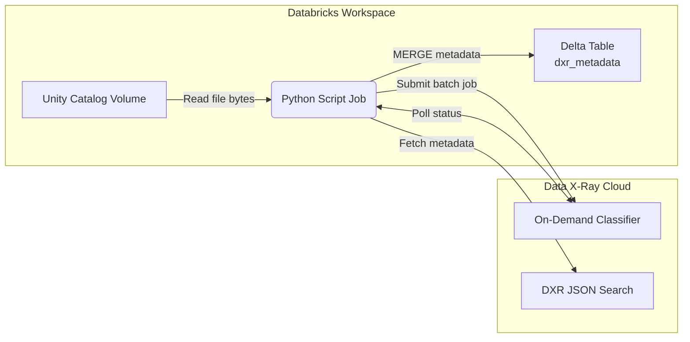

# Data X-Ray ↔ Databricks Unity Catalog Integration Playbook

This playbook ships a Databricks **Python script job** that scans a Unity Catalog Volume, submits files to the Data X-Ray On-Demand Classifier (ODC), and persists the returned metadata into a managed Unity Catalog table. Jobs can run directly on Databricks without packaging.

## How It Works



1. **Volume Scanner** – Walks `/Volumes/<catalog>/<schema>/<volume>` (optionally under a prefix) to enumerate files. The scanner records the absolute path, relative path, size, and modification time for each file.
2. **On-Demand Classifier Client** – Streams multi-part uploads to `POST /api/on-demand-classifiers/{datasource_id}/jobs`, polls job status until it reaches a terminal state, and issues a `DXR_JSON_QUERY` search keyed by `dxr#datasource_scan_id`.
3. **Metadata Store** – Converts DXR hits into structured rows keyed by the Unity Catalog file path and merges them into a managed Delta table with Spark SQL. Repeated runs simply update the existing rows.

## Runtime Configuration

Inject the following environment variables into the Databricks job task:

### Required Configuration

| Variable | Description |
| --- | --- |
| `VOLUME_CATALOG` | Catalog containing the volume to scan. |
| `VOLUME_SCHEMA` | Schema containing the volume to scan. |
| `VOLUME_NAME` | Name of the volume to scan. |
| `DXR_BASE_URL` | Data X-Ray API host (e.g. `https://api.ohalo.co`). |
| `DXR_DATASOURCE_ID` | Datasource ID for the On-Demand Classifier. |
| `DXR_SECRET_SCOPE` | Databricks secret scope storing the DXR API token. |
| `DXR_SECRET_KEY` | Key within the secret scope containing the DXR API token. |

### Optional Configuration

| Variable | Default | Description |
| --- | --- | --- |
| `VOLUME_PREFIX` | `None` | Subdirectory within the volume to scan. |
| `METADATA_CATALOG` | `VOLUME_CATALOG` | Target catalog for the metadata table. |
| `METADATA_SCHEMA` | `VOLUME_SCHEMA` | Target schema for the metadata table. |
| `METADATA_TABLE` | `<VOLUME_NAME>_metadata` | Target table name for metadata storage. |
| `DXR_POLL_INTERVAL_SECONDS` | `10` | Poll frequency in seconds. |
| `DXR_MAX_BYTES_PER_JOB` | `30MB` | Byte budget per DXR submission. |
| `DXR_MAX_FILES_PER_JOB` | `25` | Max files per DXR submission. |
| `DXR_VERIFY_SSL` | `true` | Set to `false` to allow self-signed certs. |
| `DXR_CA_BUNDLE_PATH` | `None` | Path to custom CA bundle. |
| `DXR_API_PREFIX` | `/api` | API prefix override. |
| `DXR_DEBUG` | `false` | Enable verbose debug logging. |
| `DXR_DROP_METADATA_TABLE` | `false` | Drop and recreate metadata table on run. |
| `VOLUME_BASE_PATH` | `/Volumes` | Base filesystem path override. |

The script automatically creates the metadata table if it does not exist:

```sql
CREATE TABLE IF NOT EXISTS <catalog>.<schema>.<table> (
  file_path STRING,
  relative_path STRING,
  catalog_name STRING,
  schema_name STRING,
  volume_name STRING,
  file_size BIGINT,
  modification_time BIGINT,
  datasource_id STRING,
  datasource_scan_id BIGINT,
  job_id STRING,
  file_name STRING,
  object_id STRING,
  parent_paths ARRAY<STRING>,
  mime_type STRING,
  indexed_at STRING,
  sha256 STRING,
  sha256_file_meta STRING,
  doc_language STRING,
  composite_type STRING,
  is_processed BOOLEAN,
  document_status STRING,
  text_extraction_status STRING,
  metadata_extraction_status STRING,
  dxr_tags ARRAY<STRING>,
  removed_tags ARRAY<STRING>,
  ocr_used BOOLEAN,
  categories ARRAY<STRING>,
  annotations STRING,
  folder_id STRING,
  modified_at STRING,
  binary_hash STRING,
  annotation_stats_json STRING,
  raw_metadata STRING,
  collected_at TIMESTAMP
) USING DELTA;
```

Rows are merged on `file_path`, so reclassifying a file simply updates its metadata.
⚠️ **Important:** The job expects to own a table with the schema above. If you point `METADATA_*` at an existing table with a different layout, the run will fail with a descriptive schema mismatch error; either supply a fresh table name or align the schema manually. A ready-to-import CSV definition (`metadata_schema.csv`) is included if you prefer to create the table via Databricks UI or `COPY INTO`, and it enumerates every DXR-specific column.

## Deploying the Job

1. Upload or reference this repository in your Databricks workspace.
2. Create a **Python script task** that runs `python scripts/run_pipeline.py`.
3. Attach a cluster running DBR 14.x LTS (Photon recommended) sized for your largest batch upload.
4. Configure the environment variables above in the task UI.
5. Store the DXR API key in Databricks Secrets and reference it via `DXR_SECRET_SCOPE`/`DXR_SECRET_KEY`.
6. Grant the cluster principal read access to the Unity Catalog volume and write access to the metadata table location.
7. Schedule the job as needed (hourly, daily, etc.).

## Local Development

Only unit tests and linting can run locally (reading from Unity Catalog volumes and Databricks Secrets requires a Databricks workspace). Use the provided requirements files:

```bash
cd databricks-unity-dxr-integration
python -m venv .venv && source .venv/bin/activate
pip install -r requirements-dev.txt
pytest
```

## References

- On-Demand Classifier workflow example: `../dxr/xray-docs/content/docs/usage/advanced/on-demand-classifier/workflow.mdx`
- Databricks Jobs (Python script tasks): https://docs.databricks.com/en/jobs/jobs.html#python-script-task
