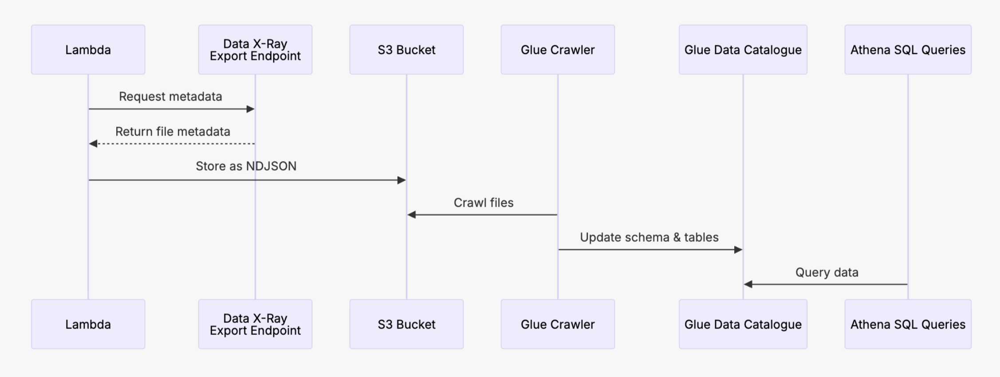

# Data X-Ray Metadata to Athena Pipeline
Data X-Ray version: **7.19.0**

This playbook shows how to operationalize the Data X-Ray metadata plane for downstream analytics:

1. Extract governance metadata from Data X-Ray with an **AWS Lambda** built and deployed via **Terraform**.
2. Persist the metadata in **Amazon S3** and register it in the **AWS Glue Data Catalog** with an automated crawler.
3. Interrogate the curated catalog using **Amazon Athena** so governance and security teams can answer discovery questions in seconds.



---

## Why this matters
- Give data stewards a searchable inventory of Data X-Ray findings without needing console access.
- Blend classification, sensitivity, and lineage signals with other enterprise datasets in Athena workgroups.
- Reuse Terraform to keep collection infrastructure reproducible across environments.

---

## Prerequisites

- Have a machine with Data X-Ray installed
- Python 3.10+
- AWS CLI
- Terraform

## List of required AWS permissions

### AWS Glue & Glue Data Catalog
- glue:GetDatabase
- glue:GetDatabases
- glue:GetTable
- glue:GetTables
- glue:GetPartition
- glue:GetPartitions
- glue:CreateJob
- glue:StartJobRun
- glue:GetJobRun
- glue:GetJobRuns
- glue:UpdateJob
- glue:DeleteJob

### AWS Athena
- athena:StartQueryExecution
- athena:GetQueryExecution
- athena:GetQueryResults
- athena:ListQueryExecutions
- athena:GetWorkGroup
- athena:ListWorkGroups

### Amazon S3
- s3:GetObject
- s3:PutObject
- s3:ListBucket 
- s3:CreateBucket
- s3:DeleteObject

### AWS Lambda
- lambda:InvokeFunction
- lambda:ListFunctions
- lambda:GetFunction
- lambda:CreateFunction
- lambda:UpdateFunctionCode
- lambda:UpdateFunctionConfiguration

### IAM PassRole
- iam:PassRole
- iam:CreateRole

## Step 1: Make sure your Data X-Ray instance has scanned data

## Step 2: Generate a PAT token from the DXR Console with your user

## Step 3: (optional) Modify the AWS Lambda function

### Modify the code

Go into `terraform/lambda/lambda_function.py` and modify the code

### Build the Lambda `.zip` archive
The following command should generate a new `lambda_function.zip` in the `terraform/lambda` folder:
```
cd terraform/lambda
./build.sh
```

Run the following if you get permission issues:
```
chmod +x build.sh
```

## Step 4: Deploy infrastructure with Terraform
Terraform would provision:
- S3 bucket
- Necessary IAM Roles
- Lambda function
- Glue crawler
- Glue Data Catalog

### Login into AWS
There are multiple options here. For example, you can use `awscli` which would prompt for access keys and setup info:
```
aws configure
```

### Deploy with Terraform
```
cd terraform
terraform init
terraform apply
```

## Step 5: Run the Lambda function
```
aws lambda invoke \
    --function-name export-jsonl-lambda \
    --payload '{"app_url": "YOUR_APP_URL", "pat_token": "YOUR_PAT_TOKEN"}' \
    --cli-binary-format raw-in-base64-out \
    output.json
```
**Note:** The `pat_token` parameter is required only for Option 2. You can leave it blank for Option 1.

## Step 6: Run the Glue crawler
```
aws glue start-crawler --name export-jsonl-crawler
```

You can also check the state of the crawler using this command:
```
aws glue get-crawler \
    --name export-jsonl-crawler \
    --query 'Crawler.State'
```
Possible values are `STOPPING`, `READY`, and `RUNNING`.

## Step 7: Query the data using Amazon Athena
```
aws athena start-query-execution \
    --query-string "SELECT * FROM exported_exports LIMIT 100;" \
    --query-execution-context Database=my_export_db \
    --result-configuration OutputLocation=s3://my-export-data-bucket/ \
    --work-group primary
```

This will output something like:
```
{
    "QueryExecutionId": "01234567-89ab-cdef-0123-456789abcdef"
}
```

Using the query ID from above, you can check the status of the query:
```
aws athena get-query-execution \
    --query-execution-id 01234567-89ab-cdef-0123-456789abcdef \
    --query 'QueryExecution.Status.State'
```

Finally, you can retrieve the query result:
(note that the format is a bit strange, so we add some parsing logic and this is subject to change)
```
aws athena get-query-results \
    --query-execution-id 01234567-89ab-cdef-0123-456789abcdef \
    --output json | jq -r '[.ResultSet.Rows[] | [.Data[].VarCharValue] ] | .[0], (.[1:][] | @tsv)'
```

## Step 8: (optional) Cleanup resources
```
terraform destroy
```
