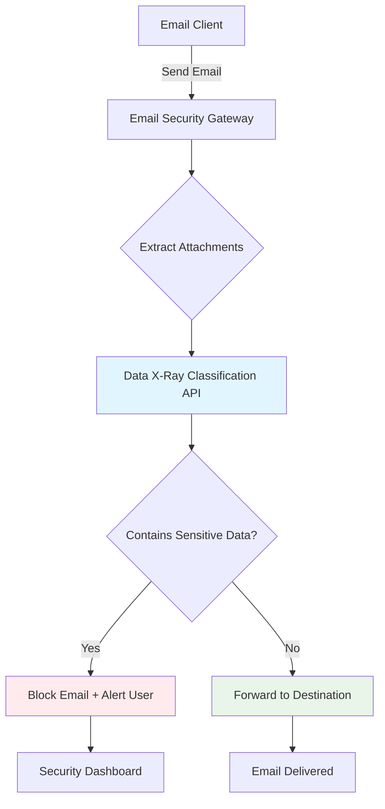

# Data X-Ray Email Security Integration Playbook

🚀 **Quick Start**: Run `./start_playbook.sh` to launch the complete playbook environment! Configure label rules in `src/smtp_proxy/blocked_labels.yaml`.

## What is this?

This Playbook shows how **Data X-Ray's AI-powered content classification** can be integrated into email security workflows to automatically detect and prevent sensitive data from leaving your organization via email attachments.

When someone tries to send an email with attachments, the system:
1. **Intercepts** the email before it leaves your network
2. **Analyzes** each attachment using Data X-Ray's classification API
3. **Blocks** emails containing sensitive content or **allows** safe emails to continue

## How It Works



This pattern can be applied to any email security solution - whether you're using enterprise tools like Proofpoint, Barracuda, or custom integrations. The key is having Data X-Ray analyze content at the gateway level before emails leave your network.

## Setup

### Prerequisites
- **Docker Desktop** - to run the playbook environment
- **Data X-Ray API Access** - API key and base URL from your Data X-Ray account
- **Email Client** - we'll show Thunderbird setup, but any SMTP client works

### 1. Configure Data X-Ray

Before running the playbook, set up classification rules in your Data X-Ray account:

1. **Create an On-Demand Classifier datasource**

2. **Set Up an Annotator:**
    - **Type**: Dictionary
    - **Keywords**: Add `financial projections` as a keyword
    - **Save**.

3. **Create a Label:**
    - **Label Name**: `Sensitive Financial Information` (case-sensitive)
    - **Query**: Add the above annotator as a condition.
    - **Enable**: Set the status as "Running" and select your On-demand Classification datasource.

When Data X-Ray scans a file and finds "financial projections", it applies this label and our integration blocks the email.

### 2. Run the Playbook

```bash
# Copy the environment template
cp .env.example .env

# Edit .env with your Data X-Ray credentials:
# DATAXRAY_BASE_URL=https://[SERVER_URL]/api
# DATAXRAY_API_KEY=your_personal_access_token
# DATASOURCE_ID=your_on_demand_classifier_datasource_ID

# Start everything!
./start_playbook.sh
```

The startup script will validate your configuration and launch:
- **SMTP Security Gateway** (port 1025) - intercepts and analyzes emails
- **MailHog Inbox** (http://localhost:8025) - shows delivered emails

### 3. Configure Your Email Client

**For Thunderbird:**
1. [Download Thunderbird](https://www.thunderbird.net/) if you don't have it
2. Go to Account Settings → Outgoing Server (SMTP)
3. Add new SMTP server:
   - **Server**: localhost
   - **Port**: 1025
   - **Security**: None
   - **Authentication**: None

**For Other Email Clients:**
Configure your client to send emails through `localhost:1025` instead of your normal mail server.

## Understanding Data X-Ray Integration

### What This Playbook Detects
This Playbook blocks emails with attachments containing the phrase "financial projections". It uses a simple dictionary-based annotator as an example.

### Beyond This Playbook
Data X-Ray offers much more sophisticated detection capabilities:
- **AI-powered classification**: Automatically categorize documents by type
- **Entity extraction**: Detect PII, financial data, or custom entities  
- **Machine learning models**: Custom models trained on your data
- **Contextual analysis**: Understanding content meaning, not just keywords

### Endless Possibilities
You can customize the labeling criteria and use any Data X-Ray metadata. For example:
- **Document categorization**: Block all financial documents regardless of content
- **Invoice analysis**: Extract details and only block invoices above a certain amount
- **Contract screening**: Detect legal agreements that need review
- **Custom entity blocking**: Block emails containing proprietary information

### Real-World Applications
This pattern is used in production for:
- **Email Security Gateways**: Integrate with Proofpoint, Barracuda, Microsoft Defender
- **Data Loss Prevention**: Complement existing DLP with AI-powered analysis
- **Compliance**: Meet GDPR, HIPAA, SOX requirements with detailed audit trails
- Meet GDPR, HIPAA, SOX requirements for data protection
- Provide detailed classification reports for audits
- Implement granular policies by content type and user role

### Customizing for Your Environment

To adapt this to your organization:

1. **Configure Classification Rules**: Update the sensitive label names in your Data X-Ray account to match your data classification policies

2. **Integrate with Your Email Infrastructure**: Replace our playbook SMTP server with calls to Data X-Ray from your existing email security tools

3. **Set Policy Actions**: Beyond blocking, you can configure warnings, encryption, or approval workflows based on classification results

## Troubleshooting

### Playbook Won't Start
- **Check Docker**: Ensure Docker Desktop is running
- **Port conflicts**: Make sure ports 1025 and 8025 aren't already in use: `lsof -i :1025`
- **Environment setup**: Verify your `.env` file has valid Data X-Ray credentials

### Email Client Issues  
- **Can't send emails**: Verify SMTP server is set to `localhost:1025`
- **Authentication errors**: Make sure authentication is set to "None" 
- **Security settings**: Disable TLS/SSL encryption for the playbook

### Data X-Ray API Problems
- **Authentication failed**: Double-check your API key in `.env`
- **Network issues**: Verify connectivity to your Data X-Ray instance
- **Label configuration**: Verify "Sensitive Financial Information" label exists and is case-sensitive

### Getting Help
- Check the logs: `docker compose logs smtp-proxy`
- Visit http://localhost:8025 to see delivered emails
- For Data X-Ray setup, visit [docs.ohalo.co](https://docs.ohalo.co)

---

## Stop the Playbook

```bash
# Stop all services
docker compose down
```

Ready to implement this in your environment? The possibilities with Data X-Ray are endless - from simple keyword blocking to sophisticated AI-powered content analysis and custom business rules.
# Stop all services
docker compose down

Ready to implement this in your environment? The possibilities with Data X-Ray are endless - from simple keyword blocking to sophisticated AI-powered content analysis and custom business rules.